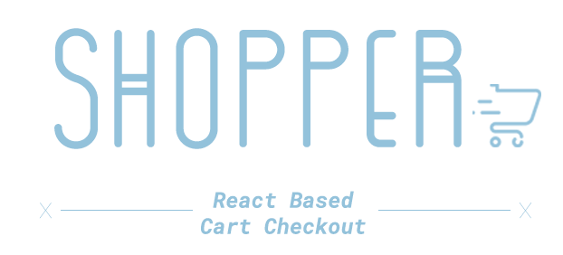

# Shopper - React Based Cart Checkouts

A React + Firebase project for an online shopping cart module which allows users to add, remove or manipulate products in their cart.

**Note**: This projects does not handle payments. It just provides live and reactive cart manipulation.

<p align="center">
  
  
  
</p>

<p align="center">
  
</p>

## 01. Statement

Shopping carts have become the most fundamental system in place for every e-commerce application. Therefore, developers now need a simple yet reactive solution for engineering such a system and this project handles exactly that.

1. **Reactive**: Shopper is extremely reactive to user inputs. Any changes made to the cart are immediately reflected across the module. Be it total cart items, amount to pay, price per item etc. Every change communicates seamlessly with the whole module to provide a more intuitive user experience.
2. **Secure**: By default, Shopper stores cart data in the session storage. All cart data is kept securely in the user's computer only. Functionality can be extended for storing the data on firebase.
3. **Un-opinionated Design**: The frontend has very minimal styling, built using [React-Bootstrap](https://react-bootstrap.github.io/) styling. Custom colors have been provided using SCSS variables for easier theming.

## 02. Setup

1. In the root of the project create a ```.env``` file for storing firebase secrets :

   ```env
   REACT_APP_FIREBASE_API_KEY=
   REACT_APP_FIREBASE_AUTH_DOMAIN=
   REACT_APP_FIREBASE_DATABASE_URL=
   REACT_APP_FIREBASE_STORAGE_BUCKET=
   REACT_APP_FIREBASE_SENDER_ID=
   REACT_APP_FIREBASE_APP_ID=
   REACT_APP_FIREBASE_MEASUREMENT_ID=

   ```

2. Use the scripts for starting the live server.

   ```sh
     yarn start
   ```

## 03. Contributing

We would love to see what you bring to this project. Feel free to file issues, open pull requests etc. But please abide by the following [guidelines](./CONTRIBUTING.md)
